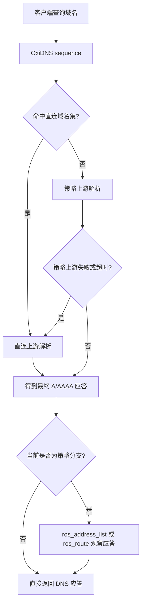
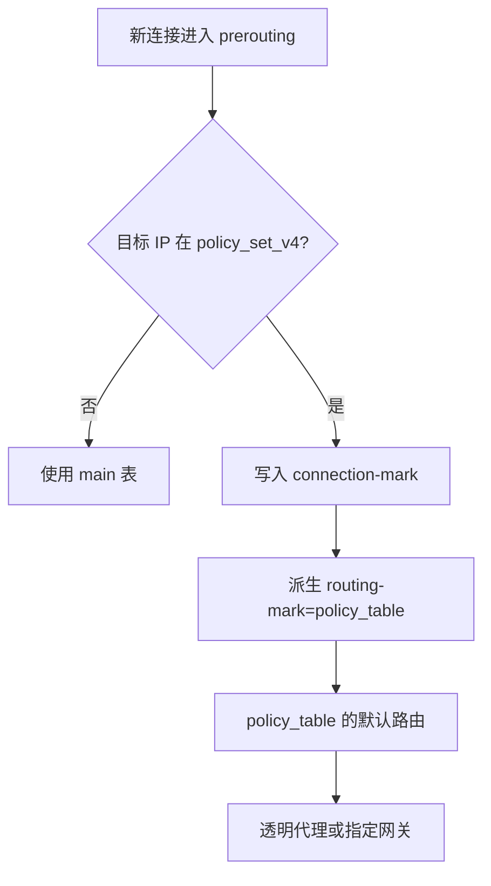
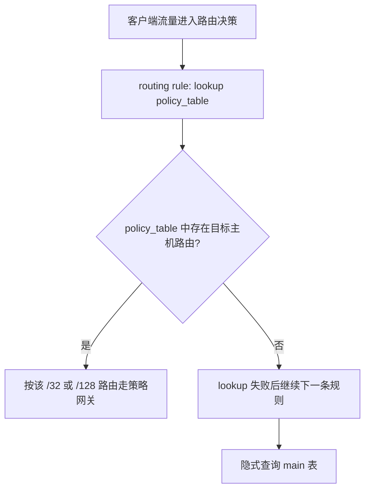
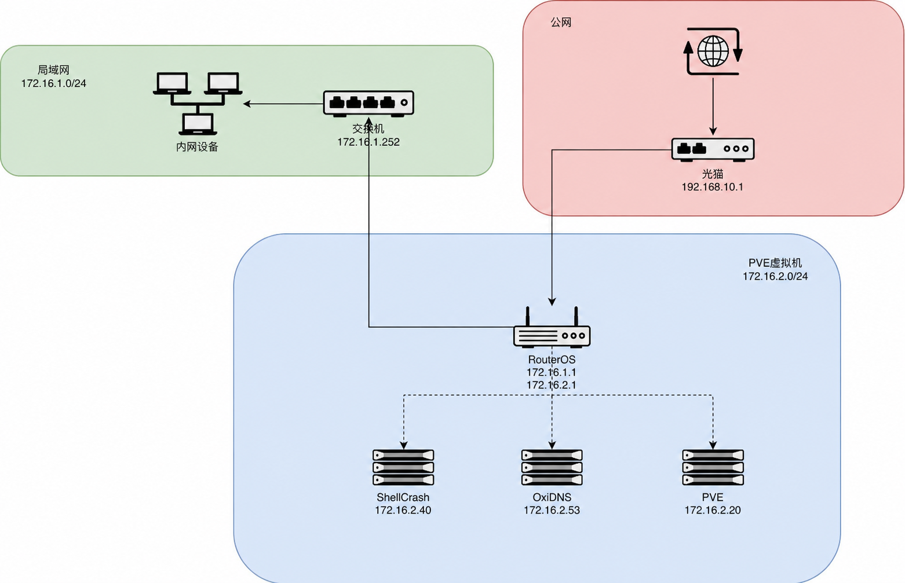

# OxiDNS Bypass

基于 **OxiDNS + MikroTik RouterOS v7** 的 DNS 驱动策略分流示例。

本仓库提供两套可选方案：

1. **`ros_address_list`**：OxiDNS 把策略域名的解析 IP 写入 RouterOS `address-list`，RouterOS 再通过 `mangle`、连接标记和路由标记选择出口。
2. **`ros_route`**：OxiDNS 直接把解析 IP 写成 RouterOS 专用路由表中的 `/32` 或 `/128` 静态主机路由，RouterOS 通过 `routing rule` 先查询该表，未命中时回落 `main`。

两套方案解决的是同一个问题：把“域名策略”转换为 RouterOS 能执行的 IP 层转发策略。实际部署时选择其中一套即可，不要让两个插件同时管理同一批目标 IP。

> 当前示例按照 OxiDNS v1.5 系列的配置与 RouterOS 插件实现整理，不再使用旧 ForgeDNS 名称、服务名或目录。

## 两个方案的共同原理

这两个方案都利用 DNS 把“域名规则”转换成 RouterOS 能执行的“IP 规则”。可以把 OxiDNS 理解成负责告诉 RouterOS“哪些目标 IP 需要走策略网关”的自动维护程序。

以客户端访问 `example.com` 为例：

1. 客户端先向 OxiDNS 查询 `example.com` 的 IP 地址。
2. OxiDNS 根据域名规则判断它应该直连，还是应该走策略网关。
3. 如果需要策略分流，OxiDNS 在返回 DNS 结果的同时，把解析得到的 IPv4/IPv6 地址同步给 RouterOS。
4. `ros_address_list` 把这些 IP 写入 RouterOS address-list；`ros_route` 把它们写成专用路由表中的主机路由。
5. 客户端拿到 DNS 结果后，才向目标 IP 建立真实连接。
6. RouterOS 看到目标 IP 已经被 OxiDNS 记录，就把连接交给策略网关；没有被记录的目标仍按 `main` 路由表正常直连。

```text
域名查询 → OxiDNS 判断策略 → 解析出目标 IP → 同步给 RouterOS
                                              ↓
客户端访问目标 IP → RouterOS 匹配该 IP → 策略网关或 main
```

DNS 在这里是“策略触发器”，不是流量代理。网页、视频和下载等实际业务流量仍然由客户端直接发给 RouterOS，不会经过 OxiDNS；OxiDNS 只负责解析域名和自动维护目标 IP。

因此，客户端必须实际使用这台 OxiDNS。设备自行使用其它 DNS、浏览器启用独立 DoH/DoT，或者应用直接连接写死的 IP，都会绕过这个域名判断过程。CDN 和多个域名共用同一个 IP 时，策略的实际粒度也只能到 IP，不能做到真正的应用层识别。

## 两套方案如何选择

| 对比项 | `ros_address_list` | `ros_route` |
| --- | --- | --- |
| OxiDNS 写入对象 | RouterOS `address-list` | 指定路由表中的静态路由 |
| 动态 IPv4 条目 | 地址项 | `/32` 主机路由 |
| 动态 IPv6 条目 | 地址项 | `/128` 主机路由 |
| RouterOS 决策方式 | `mangle` → `connection-mark` → `routing-mark` | `routing rule action=lookup` → 专用表 → `main` |
| 是否依赖 mangle | 是 | 否 |
| 连接稳定性 | 由 connection mark 固定 | 可用 `conntrack_guard` 延迟删除在用路由 |
| 策略扩展能力 | 强，适合多出口、复杂防火墙条件 | 简洁，适合“一组域名走一个网关” |
| 策略流量的数据路径 | 每包仍需经过 mangle，并按连接标记派生路由标记 | 直接按 routing rule 和 FIB 选路，不需要防火墙标记 |
| 普通直连流量 | 未命中目标 address-list 后使用 `main` | 专用表未命中后再查询 `main`，会多一次 FIB lookup |
| FastTrack | `policy_conn` 必须排除；未标记的主表连接可以使用 | 命中非主表的连接必须按策略客户端或实际代理路径排除 |
| 动态更新压力 | 更新 address-list，不触发路由表重算 | 每个地址进入 RIB/FIB，数量大、TTL 短时控制面压力更高 |
| 小中规模性能倾向 | 数据面多一层 mangle/mark 处理 | 数据路径通常略精简，但差异需要在真实流量下测量 |
| 推荐场景 | 需要精细标记、多出口，或已有 mangle 体系 | 单一策略网关、目标数量可控，希望减少 mangle |

两者不存在脱离规模和流量模型的绝对性能结论。目标 IP 只有几十到几千条、更新频率可控，并且网络模型是“一批客户端、一组域名、一个策略网关”时，`ros_route` 省掉 mangle 和连接/路由标记，数据路径通常更精简；在低负载设备上，这个差异往往小到无法体感。目标集合很大、DNS TTL 很短、路由持续增删，或者需要多出口和复杂条件时，`ros_address_list` 更容易控制，也避免频繁更新 RIB/FIB。

因此，简单网络可以优先选择 `ros_route`，复杂策略优先选择 `ros_address_list`。无论选择哪一种，只要连接实际使用了非 `main` 路由表，就不能让该连接进入 FastTrack。

## 工作流程

### 共同的 DNS 阶段



两个 RouterOS 插件都是 continuation executor：配置中必须位于能够产生最终响应的 `cache`、`fallback` 或 `forward` 之前，这样才能在回程阶段观察完整应答。它们不修改 DNS 响应；RouterOS 不可达时，DNS 结果仍会正常返回。

### `ros_address_list` 的转发阶段



### `ros_route` 的转发阶段



`ros_route` 方案的关键是使用 `action=lookup`，而不是 `lookup-only-in-table`。前者在专用表没有匹配路由时可以继续回落 `main`；后者会让未命中的目标不可达。

## 示例网络

仓库中的示例使用以下地址，请按自己的网络修改：

| 角色 | 示例值 |
| --- | --- |
| RouterOS | `172.16.1.1` |
| OxiDNS | `172.16.2.53` |
| OxiDNS DNS 监听 | `172.16.2.53:5335` UDP/TCP |
| OxiDNS 管理 API | `172.16.2.53:9199` |
| 透明代理/旁路由网关 | `172.16.2.40` |
| SOCKS5 上游代理 | `172.16.2.40:7890` |
| 策略路由表 | `policy_table` |
| 受策略控制客户端 | `172.16.1.64/26`、`172.16.1.128/26` |



## 仓库目录

```text
oxidns/
├── config.ros_address_list.yaml  # address-list + mangle 方案
└── config.ros_route.yaml         # 静态主机路由方案
```

仓库不再保存可从上游重新生成的 `dat/`、`rule/` 文本和更新脚本。两份配置直接用 `geosite` provider 读取完整 `geosite.dat`，由 OxiDNS 的 `download`、`cron` 和 `reload_provider` 自动维护；少量项目自定义域名通过 `domain_set.exps` 内联在配置中。

两份配置的 DNS 部分保持一致：直连域名使用本地上游，策略域名和未分类域名优先使用经过 SOCKS5 的 DoH 上游，失败或超过 500 ms 时回退到直连上游。两份配置只在 RouterOS 副作用插件上分叉。

## 前置条件

- RouterOS v7，已创建专用 API 账号并限制允许访问 API 的源地址。
- RouterOS 已启用 API；明文 API 通常为 TCP `8728`，API-SSL 通常为 TCP `8729`。
- OxiDNS 使用 full 构建；`oxidns build-info` 中应包含 `geosite`、`download`、`reload_provider`、`cron` 以及所选的 `ros_address_list` 或 `ros_route`。
- 客户端 DNS 确实经过 OxiDNS；浏览器或设备自行使用 DoH/DoT 会绕过本方案。
- RouterOS 的 `main` 表能够到达 OxiDNS 和策略网关。
- 已准备透明代理或其他策略网关，并确认其回程路由正确。
- 上线前保留 RouterOS Safe Mode、配置备份和可用的管理入口。

## 一、部署 OxiDNS 配置

### 1. 安装 OxiDNS

官方 Linux/macOS 安装脚本默认安装 full bundle、注册系统服务并立即启动。这里显式选择 full，并先不启动服务，便于放好本项目配置后再首次启动：

```bash
curl -fsSL https://oxidns.org/install.sh | \
  sudo env OXIDNS_BUNDLE=full OXIDNS_START_SERVICE=0 sh

oxidns --version
oxidns build-info
```

这才是安装 OxiDNS 核心的命令。旧说明里的 `sudo install -d /etc/oxidns` 只是调用系统自带的 `install` 工具创建目录，命令本身有效，但不会下载或安装 OxiDNS，而且不符合当前官方原生安装器默认使用 `/opt/oxidns` 的布局，因此本项目不再使用它。

如果机器上已经安装了 OxiDNS，跳过这一步。使用 Debian/OpenWrt 包等其它安装方式时，应以实际服务的 `-c` 和 `-d` 参数为准；本配置中的 `./rules` 会相对于 `-d` 指定的工作目录解析。

### 2. 选择一种配置

官方原生安装器默认把配置和工作目录放在 `/opt/oxidns`。只执行下面两条复制命令中的一条：

```bash
# 方案 A：address-list + mangle
sudo cp oxidns/config.ros_address_list.yaml /opt/oxidns/config.yaml

# 方案 B：静态主机路由；只执行这一条，不要与上面同时执行
sudo cp oxidns/config.ros_route.yaml /opt/oxidns/config.yaml
```

修改 `/opt/oxidns/config.yaml` 中的监听地址、RouterOS 地址、API 用户名、策略网关、SOCKS5 地址和 DNS 上游。`rules_download` 也使用示例 SOCKS5；若 GitHub 可直连，删除它的 `socks5` 字段即可。

示例通过 `${ROUTEROS_PASSWORD:-change-me}` 读取密码；Linux systemd 部署可以用 drop-in 提供环境变量，避免把真实密码提交到仓库：

```ini
# sudo systemctl edit oxidns
[Service]
Environment="ROUTEROS_PASSWORD=你的密码"
```

校验配置后再启动。静态 `check` 不会执行下载；首次 `start` 会先把缺失的 `geosite.dat` 下载到 `/opt/oxidns/rules/`，下载失败则不会带着空规则启动：

```bash
sudo env ROUTEROS_PASSWORD='你的密码' \
  /opt/oxidns/oxidns check -c /opt/oxidns/config.yaml -d /opt/oxidns --graph
sudo /opt/oxidns/oxidns service start
curl -fsS http://172.16.2.53:9199/api/readyz
```

生产环境还应为管理 API 配置认证或仅监听管理网地址。使用环境变量仍应限制 systemd 配置与进程信息的读取权限；也可以改用权限受控的 `EnvironmentFile`。

## 二、方案 A：`ros_address_list`

配置文件：[oxidns/config.ros_address_list.yaml](oxidns/config.ros_address_list.yaml)

### 1. 创建策略路由表和默认路由

```routeros
/routing table add fib name=policy_table
/ip route add dst-address=0.0.0.0/0 gateway=172.16.2.40@main routing-table=policy_table comment="oxidns policy gateway"
```

`policy_table` 在此方案中需要一条指向透明代理网关的默认路由。网关地址必须能由 `main` 表解析；`@main` 可以明确这一点。


### 2. 限制参与策略的客户端

```routeros
/ip firewall address-list add list=policy_set_src address=172.16.1.64/26 comment="oxidns clients"
/ip firewall address-list add list=policy_set_src address=172.16.1.128/26 comment="oxidns clients"
```


### 3. 配置连接标记和路由标记

```routeros
/ip firewall mangle add chain=prerouting src-address-list=policy_set_src dst-address-list=policy_set_v4 dst-address-type=!local connection-state=new connection-mark=no-mark action=mark-connection new-connection-mark=policy_conn passthrough=yes comment="oxidns policy connection"
/ip firewall mangle add chain=prerouting src-address-list=policy_set_src connection-mark=policy_conn action=mark-routing new-routing-mark=policy_table passthrough=no comment="oxidns policy routing"
```

第一条规则只在新连接首次命中 `policy_set_v4` 时写入 connection mark，第二条规则让后续数据包根据稳定的 connection mark 使用 `policy_table`。


如果启用了 FastTrack，必须保证 `policy_conn` 不会进入 FastTrack；常见做法是让 FastTrack 规则只匹配 `connection-mark=no-mark`。这样普通的 `main` 表连接仍可 FastTrack，而已经写入 `policy_conn`、需要非主表的连接会继续走完整的 mangle 和策略路由路径。否则后续 FastTrack 报文可能改用 `main`，造成路径分裂或绕过策略网关。

只有在 RouterOS 自身发起的连接也需要按此策略分流时，才额外配置 `output` 链。普通 LAN 客户端转发只需要 `prerouting`。

### 4. 确认 address-list

OxiDNS 会自动创建和刷新 `policy_set_v4`，无需预先添加空条目。动态项 TTL 默认按 DNS TTL 裁剪到 `60..3600` 秒。


## 三、方案 B：`ros_route`

配置文件：[oxidns/config.ros_route.yaml](oxidns/config.ros_route.yaml)

### 1. 创建空的策略路由表

```routeros
/routing table add fib name=policy_table
```

此方案的 `policy_table` **不要配置 `0.0.0.0/0` 默认路由**。OxiDNS 会把策略 IP 写成类似下面的条目：

```text
dst-address=203.0.113.10/32
gateway=172.16.2.40@main
routing-table=policy_table
distance=100
```

如果专用表中存在默认路由，所有命中 routing rule 的客户端流量都会走策略网关，失去“只有策略域名分流”的效果。

### 2. 让指定客户端先查询策略表

```routeros
/routing rule add src-address=172.16.1.64/26 action=lookup table=policy_table comment="oxidns ros_route"
/routing rule add src-address=172.16.1.128/26 action=lookup table=policy_table comment="oxidns ros_route"
```

处理结果：

- 目标 IP 在 `policy_table`：命中 OxiDNS 下发的主机路由，走 `172.16.2.40`。
- 目标 IP 不在 `policy_table`：本次 `lookup` 失败，RouterOS 继续后续规则并最终查询 `main`。

不要把这里的 action 改成 `lookup-only-in-table`，否则未命中的普通目标不会回落 `main`。

### 3. FastTrack 兼容性

`action=lookup` 的正常慢速路径是：先查询 `policy_table`，未命中再继续后续规则，最终查询 `main`。FastTrack 不会为后续报文完整保留这套非主表选择过程；RouterOS 官方明确要求不要 FastTrack 使用非 `main` 路由表的连接。

需要区分两类连接：

- 目标主机路由存在于 `policy_table`：连接实际使用非主表，**不能 FastTrack**。
- `policy_table` 未命中并回落 `main`：最终只使用主表，理论上可以 FastTrack。

`ros_route` 不使用 connection mark，因此 FastTrack 的排除条件应直接依据策略客户端或实际代理路径。仅仅看到连接带有 FastTrack 标志也不代表配置安全；首次报文可能按 `policy_table` 正确转发，而后续 FastPath 报文改查 `main`，形成不一致路径。

最简单、最稳妥的配置，是让所有策略客户端双向绕过 FastTrack。下面两条规则必须放在 FastTrack 规则之前：

```routeros
/ip firewall filter add chain=forward action=accept connection-state=established,related src-address-list=policy_set_src place-before=[find where action=fasttrack-connection] comment="oxidns ros_route: no FastTrack from clients"
/ip firewall filter add chain=forward action=accept connection-state=established,related dst-address-list=policy_set_src place-before=[find where action=fasttrack-connection] comment="oxidns ros_route: no FastTrack to clients"
```

上述写法适用于 FastTrack 后紧跟 `accept established,related` 的常见规则结构；它只是把同一批已建立连接提前接受。自定义防火墙如果还要对 established 流量执行其它检查，应改为给现有 FastTrack 规则增加 `src-address-list=!policy_set_src` 和 `dst-address-list=!policy_set_src` 条件，不要用提前 `accept` 绕过这些检查。

这种做法最容易验证，但策略客户端回落 `main` 的普通连接也不会获得 FastTrack。如果策略网关始终经一个独立接口到达，并且希望保留这些客户端的主表直连加速，可以只排除实际代理路径：

```routeros
/ip firewall filter add chain=forward action=accept connection-state=established,related out-interface=<proxy-interface> place-before=[find where action=fasttrack-connection] comment="oxidns ros_route: no FastTrack to proxy"
/ip firewall filter add chain=forward action=accept connection-state=established,related in-interface=<proxy-interface> place-before=[find where action=fasttrack-connection] comment="oxidns ros_route: no FastTrack from proxy"
```

执行前必须把 `<proxy-interface>` 替换成真实接口名。第二种方式的前提是所有 `policy_table` 路由都必然经过该接口，而且回程也从该接口进入。若接口还承担其它业务，这些业务也会放弃 FastTrack，但不会影响路由正确性。不要只排除单一方向；连接的请求和返回方向都必须在 FastTrack 前被接受。

修改规则后，已经标记为 FastTrack 的连接可能持续到关闭、超时或重启。生产环境可以让它们自然过期；主动清理 connection tracking 会中断现有会话，应放在维护窗口执行。

### 4. 容量与连接保护

示例启用了 `conntrack_guard: true`。动态主机路由到期时，如果 RouterOS connection tracking 中仍存在使用该目标 IP 的连接，OxiDNS 会暂缓删除并稍后重试，减少长连接被切断的概率。

但这不是无限容量机制：每个解析 IP 都会成为 RIB/FIB 中的一条路由。不要在大规模、短 TTL、变化频繁的域名集合上直接使用 `fixed_ttl: 0`；应监控 RouterOS 路由数量、内存以及 OxiDNS 的队列和错误指标。

## 四、DNS 转发

如果客户端把 DNS 发给 RouterOS，可用 dst-nat 转发到 OxiDNS。务必限制来源，避免把 OxiDNS 自己的上游请求再次重定向形成循环。

```routeros
/ip firewall nat add chain=dstnat src-address-list=policy_set_src protocol=udp dst-port=53 action=dst-nat to-addresses=172.16.2.53 to-ports=5335 comment="oxidns dns udp"
/ip firewall nat add chain=dstnat src-address-list=policy_set_src protocol=tcp dst-port=53 action=dst-nat to-addresses=172.16.2.53 to-ports=5335 comment="oxidns dns tcp"
```


如果 DHCP 已直接把 `172.16.2.53` 下发为 DNS，客户端可直接访问 `5335` 前的负载均衡/端口映射，或让 OxiDNS 直接监听 53；此时不一定需要上述 NAT。

## 五、熔断与回滚

### OxiDNS 不可用

Netwatch 检测到 OxiDNS 不可用时，可以停用两条 DNS dst-nat 规则，并恢复 RouterOS 自身 DNS：

```routeros
/ip firewall nat disable [find where comment~"oxidns dns"]
/ip dns set allow-remote-requests=yes
```

恢复后重新启用 NAT，并按实际设计决定是否关闭 RouterOS DNS：

```routeros
/ip firewall nat enable [find where comment~"oxidns dns"]
/ip dns set allow-remote-requests=no
```

### 策略网关不可用

`ros_address_list` 方案关闭第一条连接标记规则，新连接就会回到普通 `main` 路径：

```routeros
/ip firewall mangle disable [find where comment="oxidns policy connection"]
```

`ros_route` 方案关闭 routing rule，OxiDNS 留下的主机路由就不会再被客户端查询：

```routeros
/routing rule disable [find where comment="oxidns ros_route"]
```

网关恢复后执行对应的 `enable`。Netwatch 探测目标应反映真实代理可用性；只 ping 到主机并不等于透明代理服务正常。


## 六、规则自动更新

两份配置都内置同一条维护链：

1. 首次启动时，`rules_download` 发现 `./rules/geosite.dat` 缺失就先下载。
2. `rules_cron` 按 `Asia/Shanghai` 时区每天 `04:17` 运行 `rules_refresh`。
3. 新文件完整写入后才原子替换旧文件，下载失败会保留旧文件并记录 warning。
4. `reload_rule_providers` 只重载两个 `geosite` provider，不中断 DNS 服务，也不需要重建其它插件。

远程规则来自 Loyalsoldier 的 `geosite.dat` latest release。`cn`、`apple-cn`、`apple`、`category-games@cn` 进入直连集合，`geolocation-!cn` 进入策略集合；本项目自己的白名单和灰名单已内联到 `direct_domains.exps`、`policy_domains.exps`。

所以仓库中不再需要这些可下载或派生文件：旧 `dat/*.txt`、`rule/*.txt`、`telegram*.txt` 和 `update_*_data.sh`。当前方案按策略域名的实际 DNS 应答动态下发 IP，通常不需要常驻 Telegram CIDR。若自行增加 `persistent.files`，需要注意 RouterOS 插件只在应用初始化/reload 时读取它，`reload_provider` 不会刷新该文件。

## 七、验证

### 1. 验证 OxiDNS 与配置

```bash
oxidns build-info
oxidns check -c /opt/oxidns/config.yaml -d /opt/oxidns --graph
curl -fsS http://172.16.2.53:9199/api/readyz
dig @172.16.2.53 -p 5335 google.com A
```

### 2. 验证 `ros_address_list`

```routeros
/ip firewall address-list print where list=policy_set_v4
/ip firewall connection print where connection-mark=policy_conn
/ip firewall mangle print stats where comment~"oxidns"
```

### 3. 验证 `ros_route`

```routeros
/ip route print detail where routing-table=policy_table
/routing rule print detail where comment="oxidns ros_route"
```

查询策略域名后，应能看到对应 `/32` 路由、`gateway=172.16.2.40@main`、OxiDNS ownership comment 和预期 distance。再查询一个直连域名，确认不会新增策略路由。

### 4. 验证 FastTrack 边界

```routeros
/ip firewall filter print stats where action=fasttrack-connection
/ip firewall connection print detail where fasttrack=yes
/ip settings print
/interface print stats-detail
```

防火墙规则命中或连接显示 `fasttrack=yes`，只表示连接被 FastTrack 规则标记，不能单独证明报文已经通过 FastPath。还应检查 `/ip settings` 的 `ipv4-fasttrack-packets`，以及相关接口的 `fp-rx-packet`、`fp-tx-packet` 等计数。

对 `ros_address_list`，确认 `policy_conn` 没有进入 FastTrack。对 `ros_route`，确认所有经策略网关接口的连接都在 FastTrack 规则之前被接受；同时可以验证普通 `main` 表连接是否仍有 FastTrack 计数增长。

### 5. 验证出口和回退

- 从受策略控制客户端访问目标站点，检查透明代理日志或出口 IP。
- 查询直连域名，确认仍走 `main`。
- 临时停用策略网关，确认 Netwatch 能切换到无策略模式。
- 临时停用 OxiDNS，确认客户端 DNS 能按设计回退。

## 八、关键行为与注意事项

- 两个插件只观察 `A`/`AAAA` 查询的成功 `NOERROR` 响应，并收集 Answer 区中已启用地址族的地址记录。
- 同一个响应中的地址会去重；动态项按每个 IP 独立维护租约。
- 后续应答缺少旧 IP、NODATA 或 NXDOMAIN，不会立刻撤销旧项；旧项按已有租约到期。
- `min_ttl`、`max_ttl` 默认分别为 60 和 3600 秒。配置 `fixed_ttl` 后会覆盖 DNS TTL；`fixed_ttl: 0` 表示不会自然过期，必须自行评估容量和清理方式。
- `async: true` 不阻塞 DNS 主路径，但 DNS 响应返回与 RouterOS 写入完成之间存在很短的竞争窗口。必须确认首包写入时可改为 `async: false`，代价是增加 DNS 延迟。
- `persistent.files` 只在初始化/reload 时读取，文件更新后不会自动重新加载。
- 示例使用 `cleanup_on_shutdown: false` 保持重启和 reload 期间的策略连续性。切换 plugin tag、comment prefix、目标列表或路由表前，应先处理旧 ownership namespace 的条目。
- OxiDNS v1.5 的默认 `comment_prefix` 是 `oxi`。从旧版 `fdns` 迁移时，旧条目不会自动归属到新 namespace；应先清理旧条目，或在迁移阶段显式保留 `comment_prefix: fdns`。
- 不要运行两个使用相同 plugin tag、comment prefix 和 RouterOS 目标的 OxiDNS 实例。
- CDN、共享 IP、客户端缓存和绕过 OxiDNS 的加密 DNS 都可能使“域名 → IP → 路由”映射不完整；这类方案不能提供应用层级的绝对隔离。

## 九、从旧 ForgeDNS 示例迁移

本次示例的主要变化：

- 目录由旧 `/opt/forgedns` 改为官方原生安装器当前使用的 `/opt/oxidns`，服务名改为 `oxidns`。
- `api.http` 使用当前的嵌套 `listen` 结构。
- RouterOS comment 前缀由旧 `fdns` 改为 `oxi`。
- 删除旧 `v2dat`/`export-dat` 更新脚本和导出文本，改由 `download + cron + reload_provider` 直接维护 `geosite.dat`。
- 动态项不再固定保留 86400 秒，改为按 DNS TTL 在 `60..3600` 秒内裁剪，降低陈旧地址长期残留。
- fallback 只在策略上游失败或超过阈值后启动备用上游，不再让备用上游无条件并行。
- 增加直接维护 RouterOS 专用路由表的 `ros_route` 方案。
- README 中的旧域名和 ForgeDNS 链接已移除。

## 常见问题

### RouterOS 没有出现条目或路由

依次检查：

- 客户端查询是否真的进入 OxiDNS。
- 查询是否进入策略 sequence，而不是直连分支。
- 响应是否为成功的 A/AAAA 应答。
- `oxidns build-info` 是否包含所选 RouterOS 插件。
- API 地址、端口、账号权限和防火墙是否正确。
- OxiDNS 日志中是否有 RouterOS 连接、队列或重试错误。

### RouterOS 已有条目，但流量没有走策略出口

`ros_address_list` 检查 address-list 名称、mangle 顺序、connection mark、routing mark、FastTrack 和 `policy_table` 默认路由。

`ros_route` 检查 routing rule 顺序、action 是否为 `lookup`、客户端源地址是否命中，以及主机路由是否 active。还要确认配置中的 `gateway4` 与 RouterOS 实际可解析的网关语法一致。

### 首个连接偶尔走了 main

这是 `async: true` 的预期边界：客户端可能在 RouterOS 完成写入前就发出首包。可降低 OxiDNS 到 RouterOS 管理链路的延迟，或使用 `async: false` 并接受额外 DNS 延迟。

### `ros_route` 客户端能否使用 FastTrack

不能按“客户端”简单地一刀切判断。目标路由命中 `policy_table` 的连接不能 FastTrack；专用表未命中并回落 `main` 的连接理论上可以。`ros_route` 不使用 connection mark，应根据策略客户端范围或实际经过的代理接口排除 FastTrack。

优先保证正确性时，按 `policy_set_src` 双向排除全部策略客户端。需要保留主表直连性能，并且策略网关使用独立接口时，可以按代理接口的 `in-interface` 和 `out-interface` 双向排除。不要把 FastTrack 规则本身的命中计数当作实际加速已经生效的证据。

## 参考资料

- [OxiDNS 文档](https://oxidns.org/)
- [OxiDNS 本机安装与卸载](https://oxidns.org/installation/native/)
- [OxiDNS 维护与调度插件](https://oxidns.org/plugin-reference/executor/maintenance/)
- [OxiDNS RouterOS 集成插件参考](https://oxidns.org/plugin-reference/executor/integrations/)
- [OxiDNS MikroTik 策略路由](https://oxidns.org/mikrotik-policy-routing/)
- [OxiDNS 仓库](https://github.com/SvenShi/oxidns)
- [MikroTik Routing Decision](https://manual.mikrotik.com/docs/user-guides/routing-and-networking-protocols/routing-decision/)
- [MikroTik Packet Flow 与 FastTrack](https://manual.mikrotik.com/docs/firewall-and-quality-of-service/packet-flow-in-routeros/)
- [MikroTik RouterOS API](https://help.mikrotik.com/docs/spaces/ROS/pages/47579160/API)
